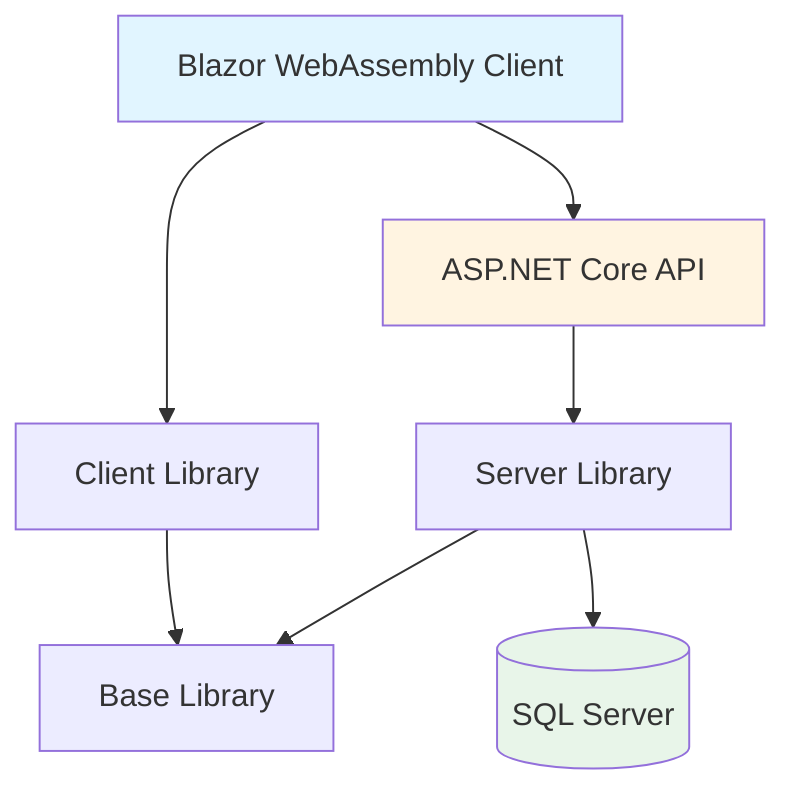
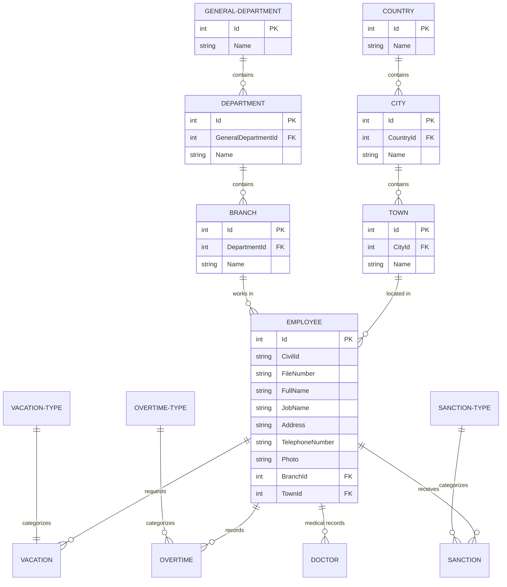
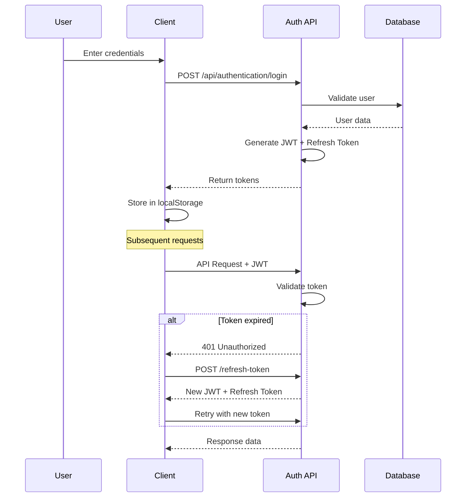
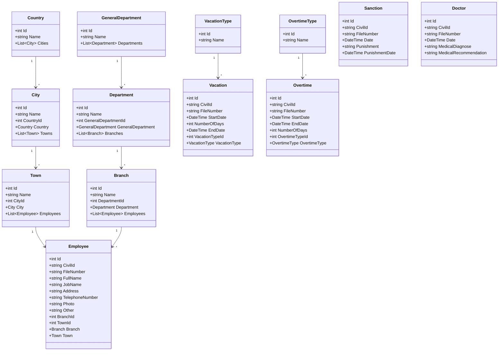
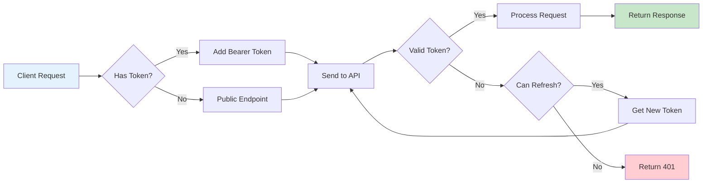
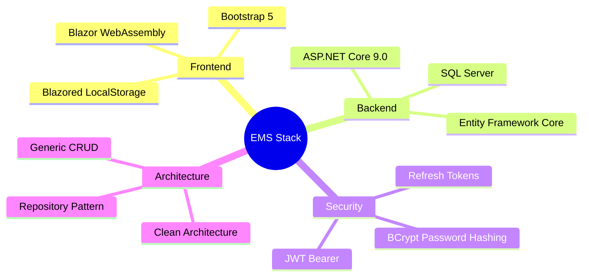
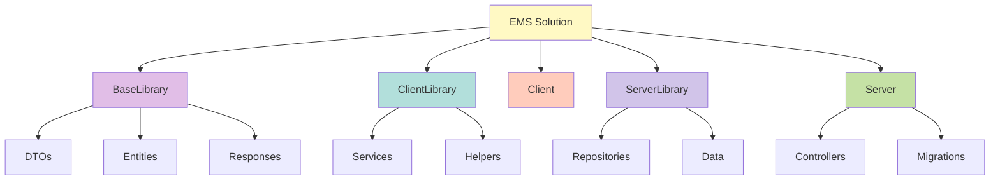
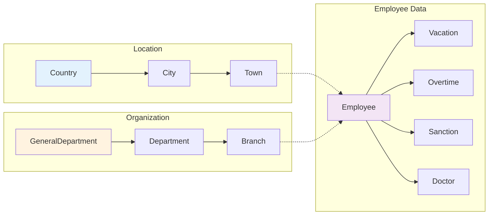
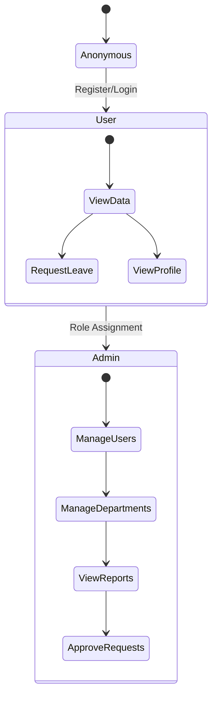

# Employee Management System (EMS)

A comprehensive employee management system built with Blazor WebAssembly and ASP.NET Core.

## 🏗️ Architecture Overview


## 📊 Entity Relationship Diagram

### Core Entities


## 🔐 Authentication Flow


## 📦 Class Diagram - Domain Entities


## 🔄 API Request Flow


## 🛠️ Technologies Used


## 🚀 Getting Started

### Prerequisites
- .NET 9.0 SDK
- SQL Server LocalDB
- Visual Studio 2022 or VS Code

### Installation

1. Clone the repository
```bash
git clone https://github.com/YOUR_USERNAME/EMS.git
cd EMS
```

2. Update database connection string in `Server/appsettings.json`

3. Apply migrations
```bash
cd Server
dotnet ef database update
```

4. Run the application
```bash
dotnet run --project Server
dotnet run --project Client
```

## 📁 Project Structure


## 🔑 API Endpoints

### Authentication
- `POST /api/authentication/register` - Register new user
- `POST /api/authentication/login` - User login
- `POST /api/authentication/refresh-token` - Refresh JWT token

### General Department
- `GET /api/generaldepartment/all` - Get all departments
- `GET /api/generaldepartment/single/{id}` - Get by ID
- `POST /api/generaldepartment/add` - Create new
- `PUT /api/generaldepartment/update` - Update existing
- `DELETE /api/generaldepartment/delete/{id}` - Delete

### Similar endpoints for:
- Department
- Branch
- Country
- City
- Town

## 📊 Database Schema


## 👥 User Roles


## 📝 License

This project is licensed under the MIT License.

---

**Built with ❤️ using Blazor and ASP.NET Core**
